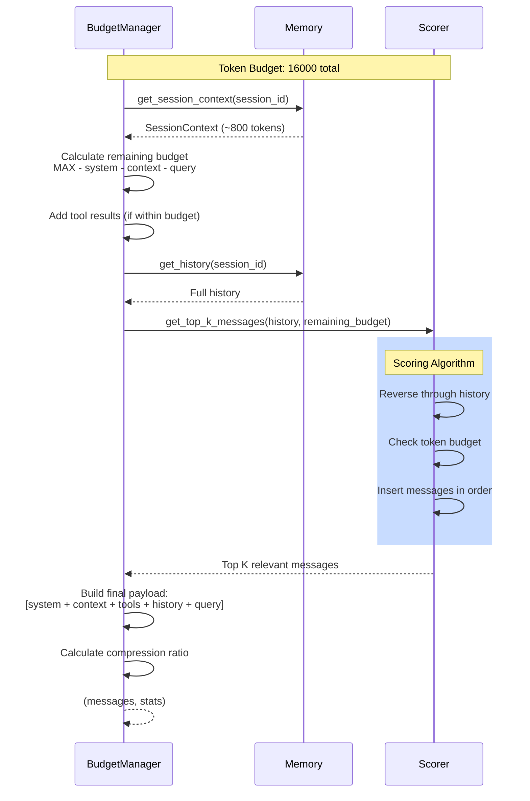
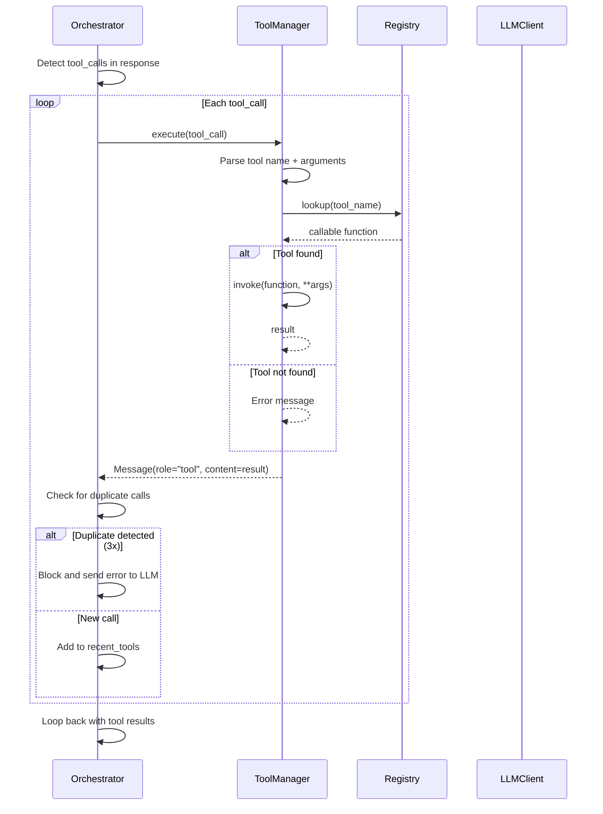
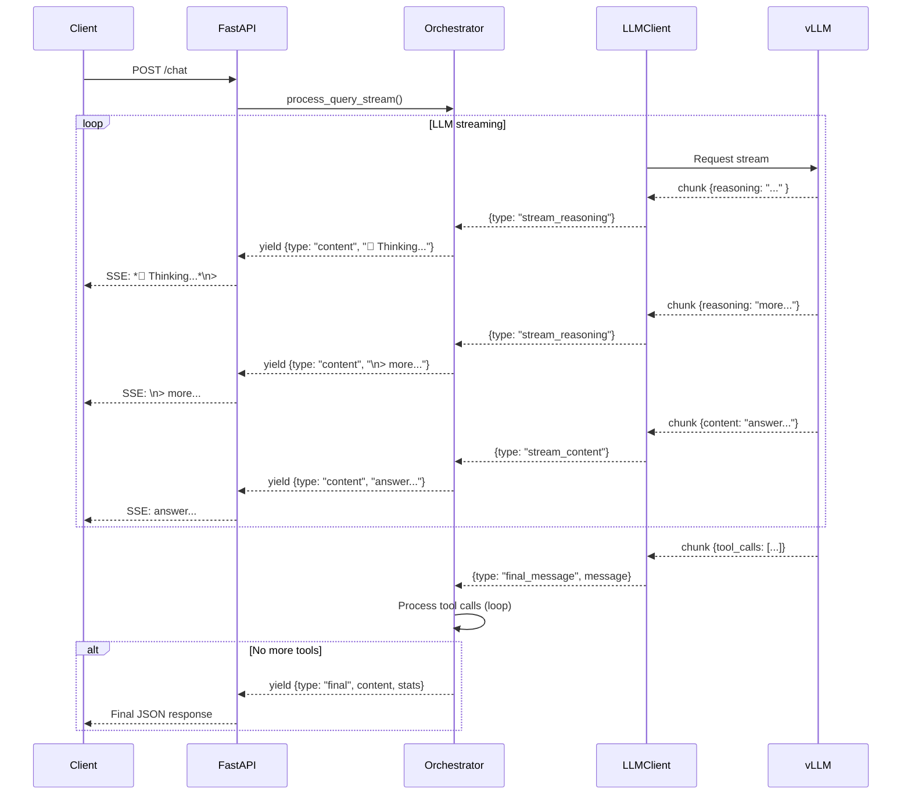
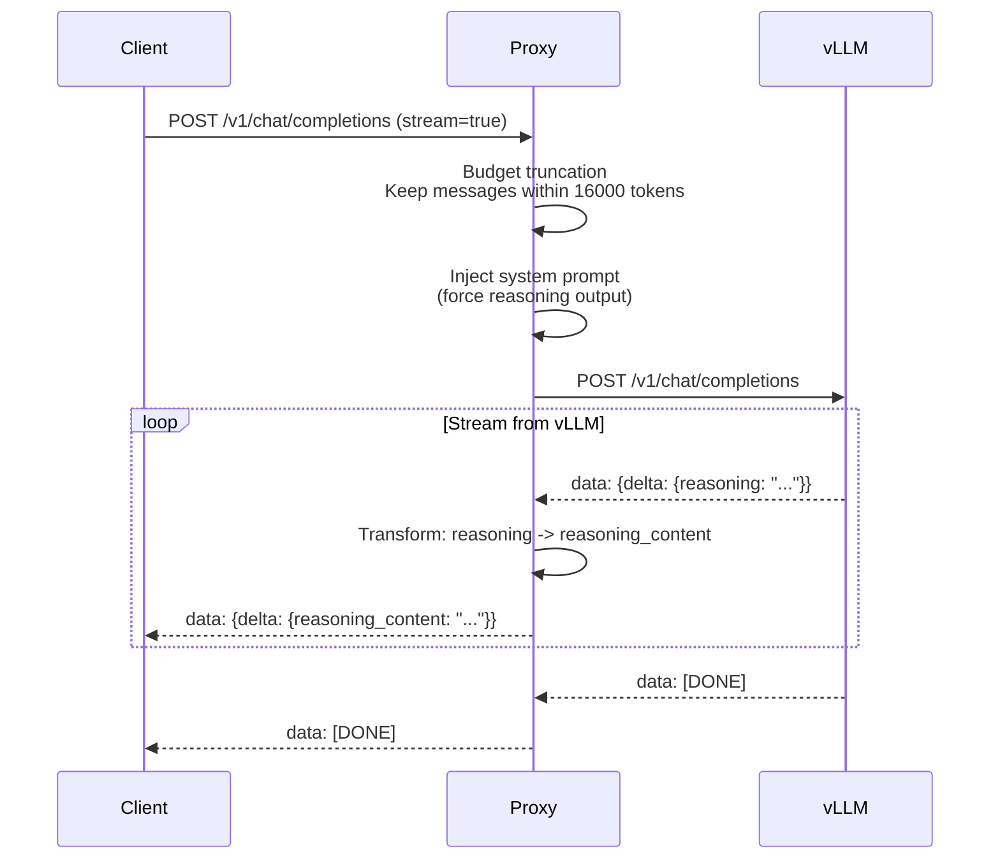

# LLM Orchestration System - Sequence Diagram

## Main Chat Flow

```mermaid
sequenceDiagram
    participant Client
    participant FastAPI
    participant Orchestrator
    participant BudgetManager
    participant Memory
    participant Scorer
    participant LLMClient
    participant ToolManager
    participant ExternalTool
    participant vLLM

    Client->>FastAPI: POST /chat (session_id, message)
    activate FastAPI
    
    FastAPI->>Orchestrator: process_query_stream(session_id, query)
    activate Orchestrator
    
    loop Max Iterations (25)
        Orchestrator->>BudgetManager: build_payload(session_id, system_prompt, query, recent_tools)
        activate BudgetManager
        
        BudgetManager->>Memory: get_session_context(session_id)
        Memory-->>BudgetManager: SessionContext
        BudgetManager->>Memory: get_history(session_id)
        Memory-->>BudgetManager: List[Message]
        
        BudgetManager->>Scorer: get_top_k_messages(history, token_budget)
        Scorer-->>BudgetManager: Selected messages (within budget)
        
        BudgetManager-->>Orchestrator: (messages, stats)
        deactivate BudgetManager
        
        Orchestrator->>LLMClient: chat_stream(messages, tools_schema)
        activate LLMClient
        
        LLMClient->>vLLM: POST /v1/chat/completions (stream=true)
        activate vLLM
        
        loop Stream chunks
            vLLM-->>LLMClient: data: {delta: {reasoning, content, tool_calls}}
            LLMClient-->>Orchestrator: yield {type: stream_reasoning/content, content}
        end
        
        Orchestrator->>FastAPI: yield streaming content
        FastAPI-->>Client: SSE stream (reasoning + content)
        
        deactivate vLLM
        deactivate LLMClient
        
        alt Has tool_calls
            Orchestrator->>ToolManager: execute(tool_call)
            activate ToolManager
            
            ToolManager->>ExternalTool: invoke(args)
            ExternalTool-->>ToolManager: result
            ToolManager-->>Orchestrator: Message(role="tool", content=result)
            deactivate ToolManager
            
            Orchestrator->>Memory: save_event(session_id, result)
            Orchestrator->>Orchestrator: Add to recent_tools, continue loop
        else No tool_calls
            Orchestrator->>Memory: save_message(session_id, query + response)
            Orchestrator-->>FastAPI: yield {type: "final", content, stats}
            deactivate Orchestrator
            break
        end
    end
    
    par Background Task
        FastAPI->>Memory: get_session_context + get_history
        FastAPI->>Compressor: compress(session_id, history, context, memory)
        Compressor->>Memory: update_session_context(session_id, updated_context)
    end
    
    FastAPI-->>Client: {response, tokens_before, tokens_after, compression_ratio, iterations}
    deactivate FastAPI
```

## Context Budget Management Flow



## Tool Execution Flow



## Streaming Response Flow



## OpenAI-Compatible Proxy Flow



## Key Components

| Component | Responsibility |
|-----------|---------------|
| **Orchestrator** | Main loop: builds context, calls LLM, executes tools |
| **ContextBudgetManager** | Manages token budget, assembles final payload |
| **RelevanceScorer** | Selects most relevant history messages within budget |
| **MemoryManager** | Stores session context, history, and events |
| **ContextCompressor** | Summarizes conversation into structured context (background) |
| **ToolExecutionManager** | Executes tool calls and returns results |
| **VLLMClient** | Communicates with vLLM server via streaming |

## Token Budget Allocation

```
MAX_TOTAL_TOKENS: 16000
├── System Prompt:       2000
├── Session Context:       800
├── User Query:          2000
├── Tool Results:        4000
└── History (dynamic):   7200
```

## Iteration Limits

- **Max tool iterations**: 25
- **Duplicate tool call block**: After 3 identical calls
- **Tool output truncation**: 6000 characters max
